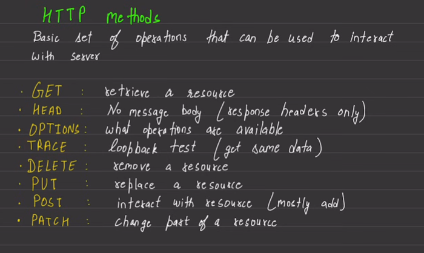
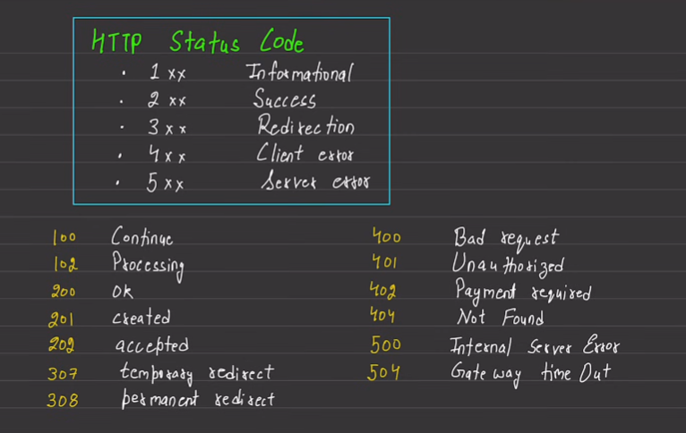

# Backend Workflow for Video Streaming

## Project Setup

1. Create database relation diagram ([Click Here](https://app.eraser.io/workspace/1jTiXvrmfgN8E4OQs68B?origin=share))
2. Add devDependencies : `npm i -D prettier` & `npm i -D nodemon`
3. Connect Database - MongoDB for this project
   1. Wrap in Try-Catch
   2. Use async
4. Setup CORS, cookieParser, static - "public" folder, etc.
5. Setup Middlewares
6. Build "Utils" as required
   - AsyncHandler
     - Instead of handling errors individually in each async function, you can handle them uniformly in one place.
     - Wrapping `async` functions with `asyncHandler` provides centralized error handling for asynchronous operations
   - code reusability
   - clean, readable code
7. Create Model Schema
   - Mongoose Midleware (Hooks) - don't use arrow function in pre hooks coz they don't have context (this and super) [Docs](https://mongoosejs.com/docs/middleware.html)
   - Pre Hook - performs an action/function just before save, update, delete, etc.
   - Mongoose Methods - custom methods (like pre-built updateOne, deleteOne)
   - JWT - bearer token (like a key, whoever posseses gets access) [Docs](https://github.com/auth0/node-jsonwebtoken)
   - Access Token and Refresh Token
8. Handling Files
   - Done using third party services - AWS, Cloudinary, etc.
   - Uploading files to **Cloudinary**
   - Setup Multer Middleware : [Multer](https://github.com/expressjs/multer) (Other package: `express-fileupload`)

## HTTP




## Project Logic

### Routes

- Use standard practices to write APIs, eg: `/api/v1/users`
- Routes and App Router

### Controllers

- logic building (user data fetch, validate, create, verify)
- using utils (asyncHandler, ApiError, ApiResponse, etc)
- sending cookies
- database operations must have `await` and wrap in try-catch
- mongodb operators like or, set, unset, etc...
- middlewares help fetch data and provides it in `req`
- subscription
  - model: subscriber, channel
  - eg:
    - [subscriber: A, channel: XYZ]
    - [subscriber: A, channel: DEF]
    - [subscriber: B, channel: XYZ]
    - [subscriber: C, channel: XYZ]
    - [subscriber: C, chennel: DEF]
  - count subs : count the docs with "XYZ" channel
  - count my subscriptions : count the docs with "A" subscriber

### Authentication

- middleware - when required multiple times
- generateAccessAndRefreshTokens, refreshAccessToken
  - when accessToken expires, can fetch refreshToken from DB and regenerate accessToken without troubling user

### MongoDB Aggregation Pipelines

- each stage performs an operation on input documents [Docs](https://www.mongodb.com/docs/manual/core/aggregation-pipeline/)
- kind of SQL joins
- eg: one DB with docs of users & author_id of books they read, another with author and their books
  ```
  db.users.aggregate( [
  // Stage 1 - Join both
  {
      $lookup: {
         from: "authors",
         localField: "author_id",
         foreignField: "_id",
         as: "author_details"
      }
  }
  // Stage 2
  {
      $addfields:{
         author_details: {
            // $first: "$author_details"
            $arrayElemAt: ["$author_details", 0]
         }
      }
  }
  // Stage 3
  {}
  // so on ....
  ] )
  ```